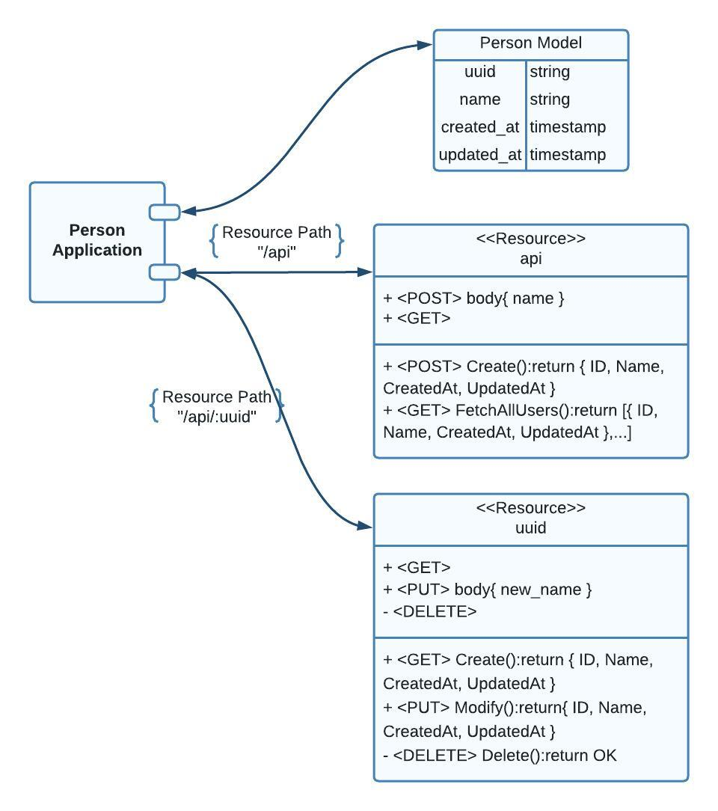

# Person API Documentation
## Introduction
The Person API is a simple yet powerful RESTT API that allows you to manage information about individuals, or "persons." This API provides endpoints for creating, retrieving, updating, and deleting on a person resource. It is designed to be user-friendly and can be integrated into various applications that require basic person management functionality. Access to a person can be done either by name or by an ID (UUID).

## API Features And Standard Formats For Requests And Responses
1. ### **Create Person**
    Creates a new person record with a name.

    **Request Format:**  
    ```
    Request URL: {domain_name}/api
    Request Method: POST
    Request Body: 
    {
      "name": "user_name"
    } 
    ```
    **Response Format:**  
    * Status Code: 200
    * Body: 
      ```json
      {
      "ID": "xxxxxxxx-xxxx-xxxx-xxxx-xxxxxxxxxx",
      "Name": "user_name",
      "CreatedAt": "2023-09-13T14:00:54.96446Z",
      "UpdatedAt": "2023-09-13T14:00:54.96446Z",
      "DeletedAt": null
      }
      ```
2. ### **Retrieve Person**
    Retrieve the record of the person stored in the database using their unique ID or name.

     **Request Format:**  
    ```
    Request URL: {domain_name}/api/UUID
    OR
    Request URL: {domain_name}/api/user_name
    Request Method: GET
    ```
    **Response Format:**
    * Status Code: 200
    * Body: 
      ```json
      {
      "ID": "xxxxxxxx-xxxx-xxxx-xxxx-xxxxxxxxxx",
      "Name": "user_name",
      "CreatedAt": "2023-09-13T14:00:54.96446Z",
      "UpdatedAt": "2023-09-13T14:00:54.96446Z",
      "DeletedAt": null
      }
      ```
3. ### **Update Person Informatoin**
    Update a person's record by providing their unique ID or name.

    **Request Format:**  
    ```
    Request URL: {domain_name}/api/UUID
    OR
    Request URL: {domain_name}/api/user_name
    Request Method: PUT
    Request Body: 
    {
      "name": "new_user_name"
    }
    ```
    **Response Format:**
    * Status Code: 200
    * Body: 
      ```json
      {
      "ID": "xxxxxxxx-xxxx-xxxx-xxxx-xxxxxxxxxx",
      "Name": "new_user_name",
      "CreatedAt": "2023-09-13T14:00:54.96446Z",
      "UpdatedAt": "2023-09-13T14:00:54.96446Z",
      "DeletedAt": null
      }
      ```
4. ### **Delete Person:**
    Delete a person's record by specifying their unique ID or name.

    **Request Format:**  
    ```
    Request URL: {domain_name}/api/UUID
    OR
    Request URL: {domain_name}/api/user_name
    Request Method: DELETE
    ```
    **Response Format:**
    * Status Code: 200

## Database And Application Structure


## Testing
> This project was hosted on railway.app, with URL:  
https://hngxstage2task-production.up.railway.app/  

## Setting Up The Server
To begin using the Person API locally, follow these steps:
1. [Install Go](https://go.dev/dl/)
2. Clone the GitHub repository: ```git clone https://github.com/Pro-282/hngxstage2task.git```
3. cd into hngxstage2task folder.
4. Update the .env file to contain the PORT AND DB_URL variable as seen below.
    ``` 
    PORT=3000
    DB_URL="host=example.postgres.com user=user password=password dbname=dbname port=5432 sslmode=disable"
    ```
   [Guide to structure the DB_URL variable](https://gorm.io/docs/connecting_to_the_database.html#PostgreSQL)
5. Run the ```migrate.go``` file to setup Person Table on the Database using:
    ```bash
    go run migrate/migrate.go
      ```
6. Run the server using ```go run main.go``` or ```go build```

## Known Limitations and Assumptions
1. This API uses Postgres DB for demonstration purposes, you could use any DB of your choice by altering ```gorm.Open()``` in ```initializers/database.go``` file.
2. No userAuth of any kind. Ensure secure access to your API in a real-world scenario.
3. This documentation assumes that the developer is well acquainted Golang, Gorm ORM and the Gin framework.

## Conclusion
The Person API simplifies the process of managing person records within your application. Whether you're building a personal information management system, a contact list, or any other application that requires person-related data, the Person API can help you get started quickly.